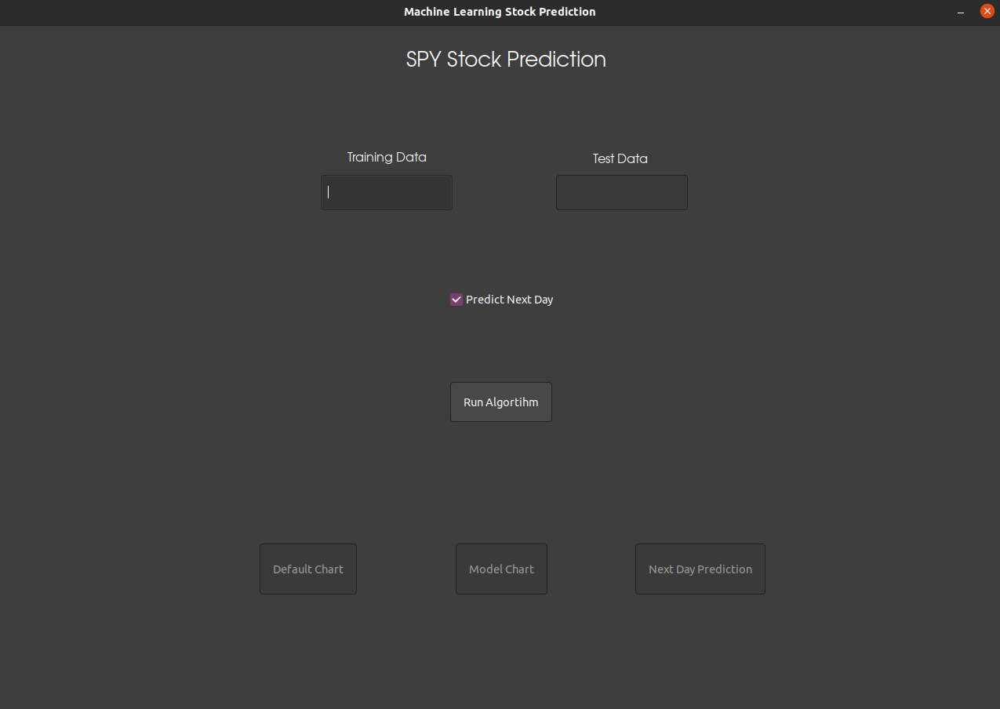

# SPY Stock Prediction Tool
This is the User Guide for installing and using the SPY Prediction Tool.

## Installation
- This tool must be used in a Linux environment with Ubuntu 20.04 as the operating system
- Anaconda is the environment tool used in this application. Here is a link to the download - [Anaconda](https://www.anaconda.com/)
- After installing Anaconda, download ---.zip file and extract in a folder of your choosing
- cd into that directory and run the command `conda env create -f environment.yml`
- After running through the installation of dependencies the program will be ready to use

## Running The Application
- From the main directory run the command `./run.sh`
- This command will require the user password to run the application

