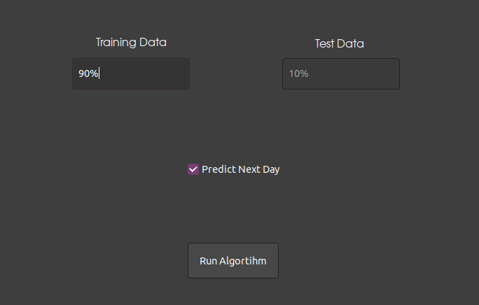

# SPY Stock Prediction Tool
This is the User Guide for installing and using the SPY Prediction Tool.

## Installation
- This tool must be used in a Linux environment with Ubuntu 20.04 as the operating system
- Anaconda is the environment tool used in this application. Here is a link to the download - [Anaconda](https://www.anaconda.com/)
- After installing Anaconda, download ---.zip file and extract in a folder of your choosing
- cd into that directory and run the command `conda env create -f environment.yml`
- After running through the installation of dependencies the program will be ready to use

## Running The Application
- From the main directory run the command `./run.sh`
- This command will require the user password to run the application
- After the command successfully runs the main application page will pop up

- The next step is to fill out the entry boxes with the necessary inputs
- Put in the percentage of data desired for the training set and the test set will be autopopulated
- If the desire for a following day forecast is needed make sure the "Predict Next Day" box is checked

- After the training data entry box is filled you can start the algorithm

- After the machine learning model is trained and contains the results you can select one of 3 charts to see relevant data
- **Default Chart** - This chart shows the stock data imported from the CSV file as a visual representation of the data on a line plot
- **Model Chart** - The Model Chart shows the line plot split into 2 different sections. The first half is the training data used to train the LSTM model. The second half is the actual data compared to predicted closing prices for the percentage used in the test set
- **Next Day Prediction** - The last chart shows the user a next day prediction compared to 9 previous days of closing prices. If the forecast is higher it will recommend the stock as a "Buy",and if the stock is lower it will recommend it as a "Sell". A linear regression line shows the current trend the stock is taking.

- Any of the chart data can be saved for future use with the menu at the bottom of each pop up. Just click the floppy disk icon and choose a directory to save to

- The application can be run multiple times to test the accuracy of results
- To close the application just click the "x" in the top right corner
